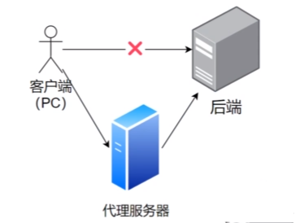
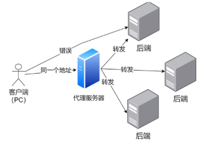

# 前后端交互

### 前端需要向后端发送请求的方式：

- 使用 ajax 来请求后端
- 使用 axios，axios 封装了 ajax
- 使用 ant design 中的 request
  - request 是 ant design 项目的又一次封装

## 代理

1. 正向代理：替客户端向服务器发送请求 
2. 反向代理：替服务器接收请求 

## 如何使用代理

- Nginx 服务器
- Node.js 服务器
- ...

## ProComponents 高级表单

1. 通过 columns 定义表格有哪些列
2. columns 属性:

- dataIndex 对应返回数据对象的属性
- title 表格列名
- copyable 是否允许复制
- ellipsis 是否允许缩略
- valueType：用于声明这一列的类型（dateTime、select）
